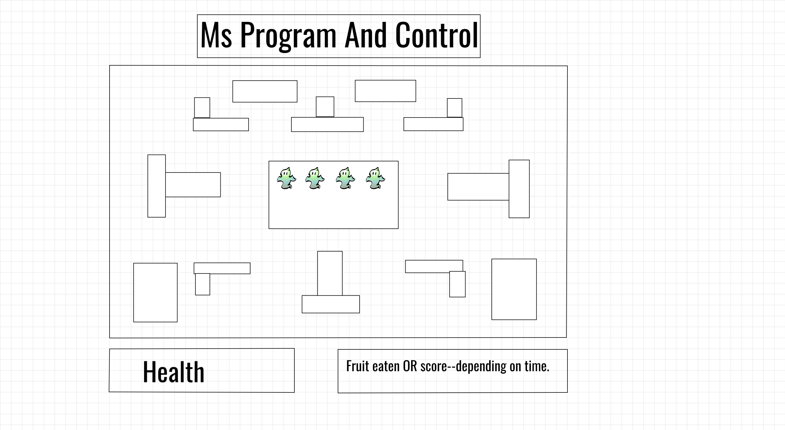

# Ms. Program And Control

[Live Link](https://kat-onyx.github.io/MsProgramAndControl/)

## Background and Overview

Ms. Program and Control is a game inspired by the beloved Ms. Pacman.  Ms. Program And Control was created using JavaScript and HTML5's canvas.  

Navigate your way through a maze to eat pellets while avoiding ghosts. At first, ghosts will move randomly throughout the map.  However, after a minute, ghosts will seek you out.  Move quickly and be careful!

Pellets offer 10 points each, and consuming all pellets will grant a total of 1280 points.

## Wireframe

## Functionality and MVP Features

* Users can press arrow keys or WASD in order to move left/right, up/down.
* Player starts with 3 lives. A player will lose a life each time they collide with a ghost.
* Ghosts are "housed" in a ghost-house.  Ghosts are released at certain intervals.  Ghosts will chase player.
* Ghost AI will change temporarily if a power-pellet is consumed.
* A player score is kept updated as the player consumes food.
* Backend to save player's high score.

## Architecture and Technologies
* JavaScript
    * Game logic
    * Class behavior
* HTML5/Canvas
    * Map render (maze) -- Canvas
    * Ghost/Ms. Pac render -- Canvas
    * Event Listeners for keybindings
* Webpack
    * Bundle and install scripts
   
## Implementation Timeline

* Day 1 (9/9/2019):
    * Finish up proposal for project, brainstorming. 
    * Create basic project skeleton.
    * Set up webpack and rest of file structure.
* Day 2 (9/10/2019):
    * Set up basic page and functionality (Canvas render)
    * Set up player input
* Day 3 (9/11/2019):
    * Make board/maze class
    * Make player class
* Day 4 (9/12/2019):
    * Make Game class
    * Make ghost class
    * Starting implementing collision logic
* Day 5 (9/13/2019):
    * Implement collision logic and wall logic
    * If finished, implement score display
* Day 6 (9/14/2019):
    * Implement score display.
    * Create sprites for animation.
* Day 7 (9/15/2019):
    * Polish/Styling
    * Implement any bonus features (possibly score saving)
