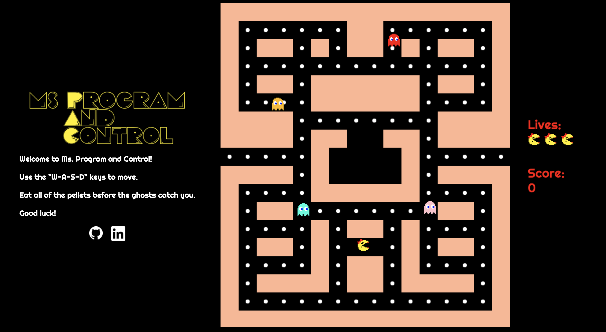

# Ms. Program And Control

[Live Link](https://kat-onyx.github.io/MsProgramAndControl/)

## Background and Overview

Ms. Program and Control is a game inspired by the beloved Ms. Pacman.  Ms. Program And Control was created using JavaScript and HTML5's canvas.  

Navigate your way through a maze to eat pellets while avoiding ghosts. At first, ghosts will move randomly throughout the map.  However, after a minute, ghosts will seek you out.  Move quickly and be careful!

Pellets offer 10 points each, and consuming all pellets will grant a total of 1280 points.




## Functionality and MVP Features

* Users can press arrow keys or WASD in order to move left/right, up/down.
* Player starts with 3 lives. A player will lose a life each time they collide with a ghost.
* Ghosts will chase a player once a certain time-interval is met.
* A player score is kept updated as the player consumes food.
* Player's life count is kept up to date.

## Architecture and Technologies
* JavaScript
    * Game logic
    * Class behavior
* HTML5/Canvas
    * Map render (maze) -- Canvas
    * Ghost/Ms. Pac render -- Canvas
    * Event Listeners for keybindings
* Webpack
    * Bundle and install scripts
   
## Core Features

### Player Movement
Player movement is handled with event listeners on the DOM, which triggers a function on the critter class.  A player's velocity is increased based on these functions, and a new position is calculated per animation frame.  No more than one key can be pressed at a time, which keeps players moving in a straight path.

``` js
keyBinds() {
    document.addEventListener("keydown", e => {
      if (e.code === "KeyD" && this.keyPressed.length <= 1) {
        this.keyPressed.push(e.code);
        this.msPac.moveRight();
      }
      if (e.code === "KeyA" && this.keyPressed.length <= 1) {
        this.keyPressed.push(e.code);
        this.msPac.moveLeft();
      }
      if (e.code === "KeyW" && this.keyPressed.length <= 1) {
        this.keyPressed.push(e.code);
        this.msPac.moveUp();
      }
      if (e.code === "KeyS" && this.keyPressed.length <= 1) {
        this.keyPressed.push(e.code);
        this.msPac.moveDown();
      }
    });

    document.addEventListener("keyup", e => {
      this.keyPressed.pop();
    });
  }

  ```

### Ghost Movement

Ghosts will calculate a current path based on the game's current time.  Critters start out with a hash object containting a lsit of possible directions to move based on a coordiante system. 

``` js
calculateDestPath(currentPath) {
    let destination = currentPath;

    for (let k in this.ghostDirs) {
        let possibleDest = [
            this.posX + this.ghostDirs[k][0],
            this.posY + this.ghostDirs[k][1]
        ]
        if (possibleDest[0] < this.posX && destination[0] < this.posX) {
            if (this.possiblePaths.indexOf(this.ghostDirs["left"]) === -1) {
                this.possiblePaths.push(this.ghostDirs["left"])
            } 
        } else if (possibleDest[0] > this.posX && destination[0] > this.posX) {
            if (this.possiblePaths.indexOf(this.ghostDirs["right"]) === -1) {
                this.possiblePaths.push(this.ghostDirs["right"])
            }
        } else if (possibleDest[1] > this.posY && destination[1] > this.posY) {
            if (this.possiblePaths.indexOf(this.ghostDirs["down"]) === -1) {
                this.possiblePaths.push(this.ghostDirs["down"])
            }
        } else if (possibleDest[1] < this.posY && destination[1] < this.posY) {
            if (this.possiblePaths.indexOf(this.ghostDirs["up"]) === -1) {
            this.possiblePaths.push(this.ghostDirs["up"])
            }
        }
    }
}
```

### The Map/Maze

The maze was create using a 2-d array bit-map containing 1's and 0's to indicate where tiles should be placed.  The maze was created by iterating over this array and instantiating Tiles if the current element was equal to 0.
```js
    this.grid = [
      [1, 1, 1, 1, 1, 1, 1, 1, 1, 1, 1, 1, 1, 1, 1, 1],
      [1, 0, 0, 0, 0, 0, 0, 1, 1, 0, 0, 0, 0, 0, 0, 1],
      [1, 0, 1, 1, 0, 1, 0, 1, 1, 0, 1, 0, 1, 1, 0, 1],
      [1, 0, 0, 0, 0, 0, 0, 0, 0, 0, 0, 0, 0, 0, 0, 1],
      [1, 0, 1, 1, 0, 1, 1, 1, 1, 1, 1, 0, 1, 1, 0, 1],
      [1, 0, 0, 0, 0, 1, 1, 1, 1, 1, 1, 0, 0, 0, 0, 1],
      [1, 1, 1, 1, 0, 0, 0, 0, 0, 0, 0, 0, 1, 1, 1, 1],
      [1, 1, 1, 1, 0, 1, 1, 4, 4, 1, 1, 0, 1, 1, 1, 1],
      [0, 0, 0, 0, 0, 1, 6, 6, 7, 6, 1, 0, 0, 0, 0, 0],
      [1, 1, 1, 1, 0, 1, 6, 6, 6, 6, 1, 0, 1, 1, 1, 1],
      [1, 0, 0, 0, 0, 1, 1, 1, 1, 1, 1, 0, 0, 0, 0, 1],
      [1, 0, 1, 1, 0, 0, 0, 0, 0, 0, 0, 0, 1, 1, 0, 1],
      [1, 0, 0, 0, 0, 1, 0, 1, 1, 0, 1, 0, 0, 0, 0, 1],
      [1, 0, 1, 1, 0, 1, 0, 2, 2, 0, 1, 0, 1, 1, 0, 1],
      [1, 0, 0, 0, 0, 1, 0, 1, 1, 0, 1, 0, 0, 0, 0, 1],
      [1, 0, 1, 1, 1, 1, 0, 1, 1, 0, 1, 1, 1, 1, 0, 1],
      [1, 0, 0, 0, 0, 0, 0, 0, 0, 0, 0, 0, 0, 0, 0, 1],
      [1, 1, 1, 1, 1, 1, 1, 1, 1, 1, 1, 1, 1, 1, 1, 1]
    ],  
```

## Upcoming Features

* Grid based movement for MsPac
* More, different mazes
* Fruit
* Power Pellets


